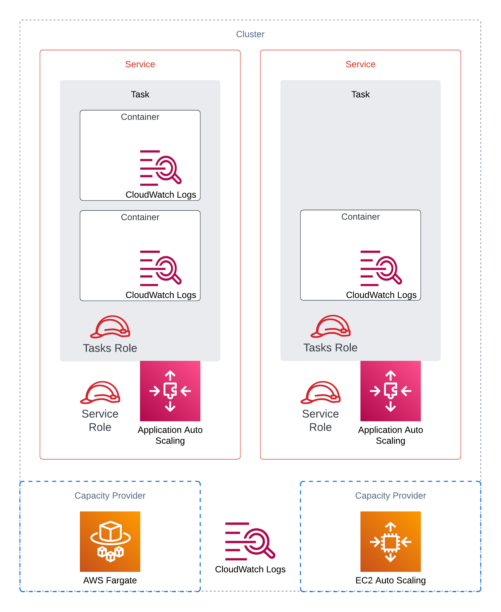
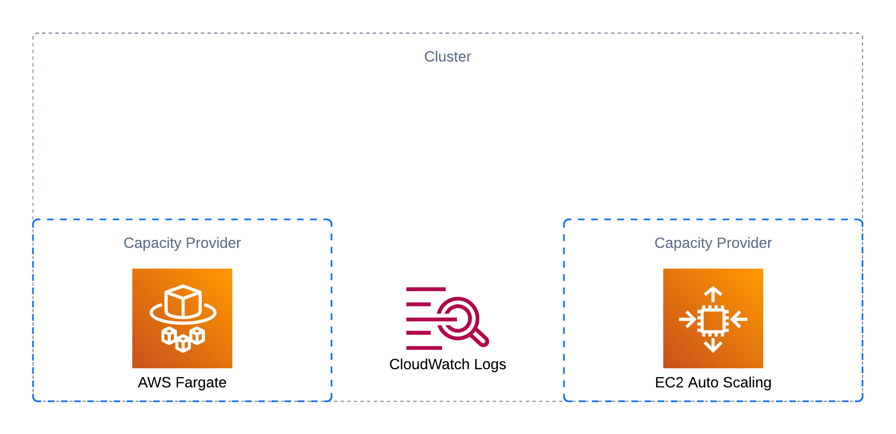
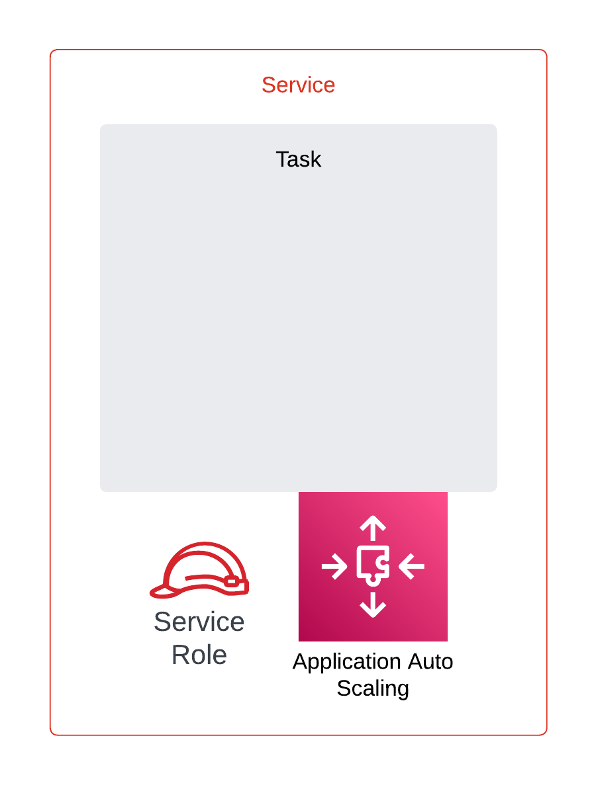
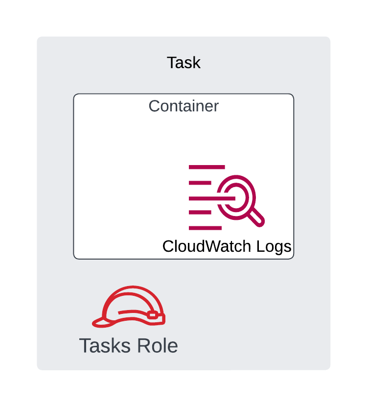

# Design

This document is intended to describe the decisions and assumptions that went into the current design of the ECS module(s). Various concepts of Amazon ECS are covered here to help align readers with the service and its capabilities and how they influence the design provided by this project.

<p align="center">
  
</p>

## ECS Constructs

At a high level, an Amazon ECS cluster is comprised of a cluster, services, and tasks. The relationship between these constructs is described below:

- A cluster may contain one or more services
- A service may contain one or more task definitions/sets
- A task may contain one to ten (max) containers

Multiple task definition/sets per service is not a common pattern used today. Therefore, this module makes the assumption that a service will contain one task definition/set. All other relationships described above are supported by this project.

### Cluster

An Amazon ECS cluster is a logical grouping of compute resources which are consumed by tasks. Compute resources are provided via capacity providers - users can elect to choose an EC2 capacity provider or Fargate capacity providers (spot or on-demand). A capacity provider strategy determines how the tasks will be distributed among capacity providers. A default capacity provider strategy can be defined at cluster level. Note you **can not** mix EC2 based capacity provider with Fargate.

### Service

An Amazon ECS service is responsible for managing its associated tasks (via task definition/task set) - the lifecycle of its tasks, the manner in which they are provisioned, their deployment model, network connectivity, etc. As stated previously, Amazon ECS services support one or more task definitions/sets per service. However, this module assumes a service will contain only one task definition/set. Some Amazon ECS service concepts to note:

- When using an external deployment controller, most of the configurations that are normally specified in the service definition are instead specified in the task set. (For users of this project, this is abstracted away and handled by the module).
- The service IAM role is used to manage the lifecycle of load balancer targets (register/deregister) for the service. If the service does not utilize a load balancer, this role is not required.

### Task

Tasks in Amazon ECS can be configured via 3 different methods:

1. From a task definition
2. From a task set (which also requires a task Definition)
3. From the ECS RunTask API (not supported by this module, but users can use the API to deploy tasks onto cluster resources created by this project)

Task sets are required when using an external deployment controller (i.e. - something outside of Amazon ECS will manage the lifecycle of updating tasks when changes are made). Task definitions are always required, even when using task sets.

A task wraps one or more container definitions (up to a max of 10 container definitions per task). You can think of a task as being synonymous to a pod in Kubernetes, and task definition/set being synonymous with a pod spec in Kubernetes.

Within the construct of tasks, there are two different IAM roles that can be configured:

1. The task execution IAM role provides permissions for Amazon ECS to access AWS resources specified within the task definition/set. When tasks are created, if a task requires access to SSM parameters and/or secrets in SecretsManager as defined in the task definition/set, the task execution role is used by Amazon ECS to retrieve those values and provide them to the tasks as environment variables. Task execution role permissions are not accessible by the containers within the task during runtime; they are only used during task creation.
2. The tasks IAM role provides permissions for the containers within the task to access AWS resources at runtime. If the application running within the container requires access to AWS resources such as retrieving files from S3 or connecting to RDS using IAM Auth, the tasks IAM role is used to provide those permissions. You can think of the tasks IAM role as being similar to the IAM instance profile used on EC2 instances, or IAM role for service accounts used by pods on Amazon EKS.

## Module Constructs

The following constructs are supported by this project. Please see their respective details below for more information on the design considerations, assumptions, and limitations.

### Cluster

The cluster sub-module creates an Amazon ECS cluster. With it, users are able to:

- Create an Amazon ECS cluster
- Enable EC2, Fargate on-demand, and/or Fargate spot capacity providers for the cluster
- Create and manage a CloudWatch log group for the cluster
- Create a task execution IAM role with the ability to extend/add permissions as necessary

When opting for EC2 capacity provider(s), users can utilize the [`terraform-aws-autoscaling` module](https://github.com/terraform-aws-modules/terraform-aws-autoscaling) to create the necessary autoscaling groups and associate them with the cluster. See the [`ec2-autoscaling` example](https://github.com/terraform-aws-modules/terraform-aws-ecs/tree/master/examples/ec2-autoscaling) which demonstrates this configuration.

This module supports creating a task execution IAM role in two different ways to support two common patterns used by Amazon ECS users:

1. Users can create one task execution IAM role and re-use, or share, this role across all services within the cluster. This pattern is commonly used when a cluster is used by one team (each team gets their own cluster). When using this pattern, users can elect to create the task execution IAM role from within the cluster module.
2. Users can create one task execution IAM role per service. This pattern is commonly used when a cluster is used by multiple teams (each team gets their own service within the cluster), and access to SSM parameters and/or secrets need to be scoped per service and therefore, per task execution IAM role. When using this pattern, users can elect to create the task execution IAM role from within the service module.

<p align="center">
  
</p>

### Service

The service sub-module creates one service that can be deployed onto a cluster. The service sub-module allows users to:

- Create an Amazon ECS service that ignores `desired_count`. This is intended for use when deploying task definition and container definition changes via Terraform
- Create an Amazon ECS service that ignores `desired_count` and `task_definition`, and `load_balancer`. This is intended to support a continuous deployment process that is responsible for updating the `image` and therefore the `task_definition` and `container_definition` while avoiding conflicts with Terraform.
- Amazon ECS task resources with the various configurations detailed below under [ECS Task](https://github.com/terraform-aws-modules/terraform-aws-ecs/blob/master/docs/README.md#ecs-task)

Since Terraform does not support variables within `lifecycle {}` blocks, its not possible to allow users to dynamically select which arguments they wish to ignore within the resources defined in the modules. Therefore, any arguments that should be ignored are statically set within the module definition. To somewhat mimic the behavior of allowing users to opt in/out of ignoring certain arguments, the module supports two different service definitions; one that ignores the `desired_count`, and one that ignores `desired_count`, `task_definition` and `load_balancer`. The motivation and reasoning for these ignored argument configurations is detailed below:

- `desired_count` is always ignored by the service module. It is very common to have autoscaling enabled for Amazon ECS services, allowing the number of tasks to scale based on the workload requirements. The scaling is managed via the `desired_count` that is managed by application auto scaling. This would directly conflict with Terraform if it was allowed to manage the `desired_count` as well. In addition, users have the ability to disable auto scaling if it does not suit their workload. In this case, the `desired_count` would be initially set by Terraform, and any further changes would need to be managed separately (outside of the service module). Users can make changes to the desired count of the service through the AWS console, AWS CLI, or AWS SDKs. One example workaround using Terraform is provided below, similar to the [EKS equivalent](https://github.com/bryantbiggs/eks-desired-size-hack):

  ```hcl
  resource "null_resource" "update_desired_count" {
    triggers = {
      # Changes to this value will trigger the API call execution below
      desired_count = 3
    }

    provisioner "local-exec" {
      interpreter = ["/bin/bash", "-c"]

      # Note: this requires the awscli to be installed locally where Terraform is executed
      command = <<-EOT
        aws ecs update-service \
          --cluster ${module.ecs.cluster_name} \
          --service ${module.ecs_service.name} \
          --desired-count ${null_resource.update_desired_count.triggers.desired_count}
      EOT
    }
  }
  ```

- In addition to always ignoring `desired_count`, users can elect to ignore changes to task definitions by setting `ignore_task_definition_changes` to `true`. (Note: because of the aforementioned manner in which this psuedo-dynamic ignore change is being managed, changing this value after service creation will cause the entire service to be re-created. Change with caution!) This is primarily intended to support the external deployment controller as well as continuous delivery patterns where an [external process is changing the task definition](https://github.com/aws-actions/amazon-ecs-deploy-task-definition). The entire task definition argument is ignored due to the fact that any changes within the task definition, including changes to the container definition(s), results in a new task definition revision. As an alternative, this module does provide a work around that would support an external party making changes to something like the `image` of the container definition. In a scenario where there the service, task definition, and container definition are all managed by Terraform, the following configuration could be used to allow an external party to change the `image` of the container definition without conflicting with Terraform, provided that the external party is also updating the image tag in a shared location that can be retrieved by Terraform (here, we are using SSM Parameter Store):

  ```hcl
  data "aws_ssm_parameter" "app_image_tag" {
    name = "/my-app/image-tag"
  }

  data "aws_ecr_repository" "app" {
    name = "my-app-repository"
  }

  data "aws_ecr_image" "app" {
    repository_name = data.aws_ecr_repository.app.name
    image_tag       = data.aws_ssm_parameter.app_image_tag.value
  }

  module "ecs_service" {
    source = "terraform-aws-modules/ecs/aws//modules/service"

    # ... omitted for brevity

    container_definitions = {
      default = {
        name  = data.aws_ecr_repository.app.name
        image = "${data.aws_ecr_repository.app.repository_url}@${data.aws_ecr_image.app.id}"
        # ...
      }
    }

    # This is the default, but just to clarify on this example that we are NOT ignoring
    # task definition changes, and still allowing an external party to modify the image/tag
    # without conflicting with Terraform
    ignore_task_definition_changes = false
  }
  ```

This could be expanded further to include the entire container definitions argument, provided that external party making changes to the container definitions provides a copy that Terraform can retrieve and use when making updates to task definitions. This is possible due to the use of the `aws_ecs_task_definition` data source in the module - the data source retrieves the task definition currently defined in AWS. Using the `max()` function in Terraform, we can get the latest version via `max(aws_ecs_task_definition.this[0].revision, data.aws_ecs_task_definition.this[0].revision)` and use that as the `task_definition` value through reconstructing the `family:revision` format such as `"${aws_ecs_task_definition.this[0].family}:${local.max_task_def_revision}"`. With this work around, any changes made by Terraform would result in a new task definition revision resulting in Terraform updating the revision and deploying that change into the cluster. Likewise, any external party making changes to the task definition will increment the revision and deploy that into the cluster. Provided that Terraform can refer to the same values of the arguments changed by the external party, Terraform will be able to have a complete view of the current status and only make changes when necessary, without conflicting with the external party.

<p align="center">
  
</p>

- When using the above `ignore_task_definition_changes` setting, changes to the `load_balancer` argument are also ignored. This is intended to support the use of [Blue/Green deployment with CodeDeploy](https://docs.aws.amazon.com/AmazonECS/latest/userguide/deployment-type-bluegreen.html) which changes the the service's load balancer configuration. (Note: the ignored changes to the `load_balancer` were added after the fact which is why the variable name does not reflect this behavior. In a future major release, this variable will be updated to better reflect its behavior)

```hcl
  module "ecs_service" {
    source = "terraform-aws-modules/ecs/aws//modules/service"

    # ... omitted for brevity

    ignore_task_definition_changes = true
  }

  resource "aws_lb_target_group" "this" {
    for_each = {
      blue = {},
      green = {}
    }

    name = each.key

    # ... omitted for brevity
  }

  resource "aws_codedeploy_app" "this" {
    name             = "my-app"
    compute_platform = "ECS"
  }

  resource "aws_codedeploy_deployment_group" "this" {
    deployment_group_name = "my-deployment-group"
    app_name              = aws_codedeploy_app.this.name

    deployment_config_name = "CodeDeployDefault.ECSAllAtOnce"

    deployment_style {
      deployment_option = "WITH_TRAFFIC_CONTROL"
      deployment_type   = "BLUE_GREEN"
    }

    # ... omitted for brevity

    load_balancer_info {
      target_group_pair_info {
        prod_traffic_route {
          listener_arns = ["my-listener-arn"]
        }

        target_group {
          name = aws_lb_target_group.this["blue"].name
        }

        target_group {
          name = aws_lb_target_group.this["green"].name
        }
      }
    }
  }
```

### Task

ECS tasks are the byproduct of task definitions and task sets. In addition to what has been described above, the service module supports the following task level configurations:

- Create task definition with support for n-number of container definitions (min 1, max 10 per AWS API)
- Create task execution IAM role and associated permissions. This is one of two routes previously described for creating a task execution role, where creating it at the service level is primarily intended to ensure parameters and secrets are only accessible by the tasks created in the respective service, and not shared across all services.
- Create tasks IAM role & permissions used by the containers during runtime
- Create task set that ignores `scale`; this is equivalent to the service and its ignored `desired_count`
- Create task set that ignores `scale` and `task_definition`; again, equivalent to the service and its ignored `desired_count` and `ignore_task_definition_changes`
- Create an application autoscaling target, policy, and schedule action to autoscale the number of tasks

The same workaround described above where an external party can modify the task definition without conflicting with Terraform can be used here as well since task sets require a task definition and the module's implementation uses the same one throughout.

Application auto scaling is enabled by default and can be disabled by setting `enable_autoscaling` to `false`. See the mentioned work around above for adjusting the `desired_count` of the service to adjust the number of tasks. The equivalent for task set using an external deployment controller is provided below:

  ```hcl
  resource "null_resource" "update_scale" {
    triggers = {
      # Changes to this value will trigger the API call execution below
      scale = "value=50,unit=PERCENT"
    }

    provisioner "local-exec" {
      interpreter = ["/bin/bash", "-c"]

      # Note: this requires the awscli to be installed locally where Terraform is executed
      command = <<-EOT
      aws ecs update-task-set \
        --cluster ${module.ecs.cluster_name} \
        --service ${module.ecs_service.name} \
        --task-set ${module.ecs_service.task_set_arn} \
        --scale ${null_resource.update_scale.triggers.scale}
      EOT
    }
  }
  ```

<p align="center">
  
</p>

#### Container Definition

The container definition sub-module provided by the project is intended to be used as a building block for the container definitions argument of the task definition and to fill the gap [until a native Terraform resource is provided](https://github.com/hashicorp/terraform-provider-aws/issues/17988) for container definitions.

Within a container definition, there are primarily 2 ways in which logs are created/managed:

1. Via Cloudwatch logs: When users provide a name to `awslogs-group`, if the CloudWatch log group does not exists, ECS will create it. This means it is created outside of IaC and therefore will not be deleted when the task/container definition is deleted, nor tagged, etc.
2. Via Firelens: Firelens allows users to provide a configuration that will forward logs to various locations, including 3rd party locations. When using Firelens though, users will need to add a FluentBit sidecar to forward logs to the Firelens service which will send logs to the final destination based on the `firelensConfiguration`

In this module we aim to provide support for both, but with the addition of affording users the ability to manage the Cloudwatch log group through Terraform. This is the similar scenario we face with other modules as well - RDS, Lambda, EKS - that will automatically create log groups when logging is enabled. This sub-module provides support for creating the Cloudwatch log groups so that users can tag the log groups, set the retention period, , encrypt the log groups with KMS, ensure logs are destroyed when the resources are, etc. This is the reason why the Cloudwatch log resource is provided in this sub-module; to allow users to control the log group through Terraform/IaC

The default behavior of the container definition module is to create the CloudWatch log group on behalf of users to ensure it can be fully managed through Terraform. This leads to the following scenarios for logging:

1. Disable logging entirely

   ```hcl
   module "ecs_service" {
     source = "terraform-aws-modules/ecs/aws//modules/service"

     # ... omitted for brevity

     container_definitions = {
       default = {
         enable_cloudwatch_logging = false
         # ...
       }
     }
   }
   ```

2. Use CloudWatch logging - opt out of Terraform managing the Cloudwatch log group and instead ECS will create the log group:

   ```hcl
   module "ecs_service" {
     source = "terraform-aws-modules/ecs/aws//modules/service"

     # ... omitted for brevity

     container_definitions = {
       default = {
         create_cloudwatch_log_group = false
         # ...
       }
     }
   }
   ```

3. [Default] Use CloudWatch logging - Let Terraform manage the Cloudwatch log group:

   ```hcl
   module "ecs_service" {
     source = "terraform-aws-modules/ecs/aws//modules/service"

     # ... omitted for brevity

     container_definitions = {
       default = {
         # ...
       }
     }
   }
   ```

4. Use Firelens for log forwarding:

   ```hcl
   data "aws_ssm_parameter" "fluentbit" {
     name = "/aws/service/aws-for-fluent-bit/stable"
   }

   module "ecs_service" {
     source = "terraform-aws-modules/ecs/aws//modules/service"

     # ... omitted for brevity

     container_definitions = {
       # FluentBit sidecar is required for Firelens
       fluent-bit = {
         image = data.aws_ssm_parameter.fluentbit.value
         firelens_configuration = {
           type = "fluentbit"
         }
         # ...
       }

       default = {
         dependencies = [{
           containerName = "fluent-bit"
           condition     = "START"
         }]

         enable_cloudwatch_logging = false
         log_configuration = {
           logDriver = "awsfirelens"
           options = {
             # ...
           }
         }
         # ...
       }
     }
   }
   ```
